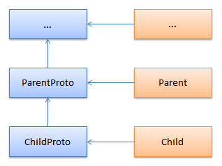

## Objects

The name of constructor function should be formatted in upper camel case.
Properties and methods should be named in lower camel case.
The underscore prefix should be used for private/protected properties and methods.

Each line contains at most one property.
Methods is always separated using one blank line.

```javascript
MyObject = function (someValue) {

    this.propA = "abc";
    this.propB = 16;
};
```

Objects should be created using the `new` operator.

```javascript
var my = new MyObject(15);
```

The dot notation is used to access to properties and methods.

```
my.propA = "efg";
my.propB = 4;
```

The factory method pattern should be used for the high-level public API.

```javascript
var some = Module.makeSome(),
    another = some.makeAnother();
```

Always separate properties and methods using following pattern:

```javascript
Vector2Proto = function () {

    this.mul = function (s) {

        this.x *= s;
        this.y *= s;
        return this;
    };
};

Vector2 = function (x, y) {

    this.x = x;
    this.y = y;
};

Vector2.prototype = new Vector2Proto();
```

Inheritance chains should be defined using following pattern:



```javascript
ParentProto = function () {

    this.doSome = function () {

        // methods
    };
};

Parent = function (args) {

    // properties
};

Parent.prototype = new ParentProto();
```

```javascript
ChildProto = function () {

    // method overriding
    this.doSome = function () {

        // specific actions

        Parent.doSome.call(this);
    };
};

ChildProto.prototype = Parent.prototype;

Child = function (args) {

    Parent.call(this, args);

    // properties
};

Child.prototype = new ChildProto();
```

The `null` value should be used to assign or compare a variable that intended to be an object value.

[:arrow_backward:](functions.md) [:arrow_forward:](errors.md)
